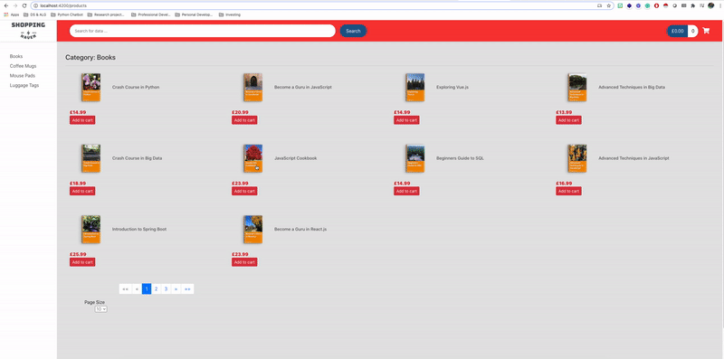

# Shopping Haven

An e-commerce site built with Angular and Spring Boot, which interacts with a MySQL database.

## Demonstration 

## Getting Started
----
### Prerequisites
----
As a prerequisite for this deployment you <b>must</b> have the following set up on your PC before you can proceed:

#### Backend requirements
* A Java IDE: [IntelliJ](https://dev.mysql.com/doc/mysql-getting-started/en/) 
* Local MySQL DB instance - [Setup guide](https://dev.mysql.com/doc/mysql-getting-started/en/) 
* Java Development Kit: [JDK11](https://www.oracle.com/java/technologies/javase-jdk11-downloads.html)
* Maven: [Setup guide](https://www.tutorialspoint.com/maven/maven_environment_setup.htm)

#### Frontend requirements
* Node.js: [Source](https://nodejs.org/en/)
* npm package manager: (This should be installed by default with Node.js, run `npm -v` in a terminal window to verify.) If this isn't already on your PC, [npm client](https://docs.npmjscom/cli/install) to install.
* Angular CLI: run `npm install -g @angular/cli` to install.
----
### Deployment 
----
#### Backend API deployment

1.  Ensure you have a Local MySQL DB instance running and have the credentials available (upon application start up the Java application will create the required schema/tables and insert the data).
2.  In the `application.properties` file located in the `shopping-haven-backend/src/main/resources` folder, ensure that the variables `spring.datasource.password` and `spring.datasource.username` match your local MySQL instance credentials.  
3.  Run `mvn clean install package` using your IDE **or** from the command line at the base level of the project.

Then proceed to run the application by:  
 - Running the ShoppingHavenApplication class in your IDE  
**or**  
 - Run `java -jar target/shopping-haven-0.0.1-SNAPSHOT.jar` from the base level of the project in the command line. 
 
**Navigate to the [localhost/api](http://localhost:8080/api) webpage and the API should be live and running.**

----

### Great, if you've reached this far it means the API is atleast running and ready for the frontend application to make requests
----
#### Frontend deployment

1.  Navigate to the `shopping-haven-angular-frontend` folder on your command line or IDE terminal, proceed to run `ng serve --open` which will deploy the frontend application and open the webpage in your browser.
 
**If the webpage doesn't open, navigate to [localhost:4200](http://localhost:4200/) which is the default port for Angular applications.**

***Awesome, enjoy the application and feel free to contact me at [personal website](http://jiedwards.github.io/) to leave me any feedback/recommendations.***
----

## Running the tests

The backend unit tests in place verify that the API is working as expected, it tests the repositories and the API endpoints. The test should automatically run during the install and package phase of the `mvn` command above.

## Future Improvements

* Implement security JWT tokens
* Implement login/register/logout functionality 
* Implement Angular frontend testing

## Acknowledgments

* [Full Stack: Angular and Spring Boot course](https://www.udemy.com/course/full-stack-angular-spring-boot-tutorial/)
